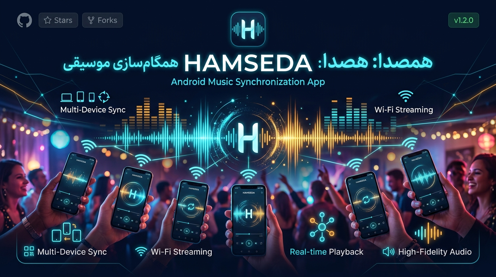

<div align="center">

# 🎵 هم‌صدا (HamSeda)
### سامانه پخش همزمان و هماهنگ موسیقی روی چندین گوشی با شبکه Wi-Fi



[](https://kotlinlang.org)
[](https://developer.android.com/jetpack/compose)
[](https://www.android.com)
[](LICENSE)

**تبدیل چندین گوشی تلفن همراه به یک سیستم صوتی فراگیر، قدرتمند و هماهنگ (مشابه SoundSeeder)**

[دانلود فایل نصبی (APK)](build-outputs/app-debug.apk) • [امکانات کلیدی](#-امکانات-کلیدی-نرم‌افزار) • [راهنمای استفاده](#-راهنمای-استفاده) • [معماری فنی](#-معماری-و-فناوری‌های-به‌کاررفته)

</div>

---

## 📖 معرفی پروژه

**«هم‌صدا»** یک اپلیکیشن مدرن و بومی اندروید است که به شما امکان می‌دهد چندین گوشی هوشمند را از طریق یک شبکه وای‌فای مشترک (یا هات‌اسپات بدون نیاز به اینترنت) به یکدیگر متصل کنید و یک قطعه موسیقی را با **هماهنگی زمانی فوق‌العاده دقیق و بدون تاخیر یا اکو** روی همه آن‌ها پخش نمایید. 

علاوه بر پخش هماهنگ، قابلیت‌های کاربری جذابی همچون **پلی‌لیست مشترک با امکان رأی‌دهی به آهنگ‌ها**، **کنسول کنترل از راه دور برای تنظیم بلندی صدای تک‌تک بلندگوها** و **کالیبراسیون تاخیر سخت‌افزاری** در این نرم‌افزار پیاده‌سازی شده است.

---

## ⚡ امکانات کلیدی نرم‌افزار

### ۱. همگام‌سازی صدا با دقت میلی‌ثانیه‌ای (Wi-Fi Audio Sync)
- **موتور همگام‌سازی کلاک محلی (Local NTP Engine):** محاسبه پیوسته زمان رفت و برگشت پکت‌های شبکه (RTT) و تصحیح اختلاف زمانی ساعت داخلی گوشی‌ها با دقت میلی‌ثانیه.
- **تنظیم سرعت دینامیک (Phase Micro-Adjustment):** تنظیم ریز و نامحسوس سرعت پخش (بین ۰.۹۸ تا ۱.۰۲ برابر) در کسری از ثانیه جهت صفر کردن ناهماهنگی بدون قطع صدا یا لرزش فرکانسی.
- **کالیبراسیون دستی تاخیر (Latency Calibrator):** اسلایدر و کلیدهای تنظیم گام‌های ۵± و ۲۵± میلی‌ثانیه برای جبران تاخیر سخت‌افزاری بلندگوهای مختلف و اسپیکرهای بلوتوثی متصل.

### ۲. کشف هوشمند دستگاه‌ها در شبکه (NSD / mDNS و Wi-Fi Direct)
- **سرویس کشف شبکه استاندارد (Android NsdManager):** ثبت و کشف خودکار سرویس صوتی بر پایه پروتکل `_hamseda._tcp` بدون نیاز به تنظیمات دستی یا درگیری با محدودیت‌های برادکست روترها.
- **پشتیبانی از Wi-Fi Direct (P2P):** کشف و اتصال مستقیم همتا‌به‌همتا میان دستگاه‌های اندرویدی مجاور.
- **پشتیبانی چندلایه‌ای همراه با UDP Beacon:** شناسایی خودکار در شبکه محلی حتی در شبکه‌های ایزوله‌شده با امکان اتصال مستقیم با آی‌پی (Direct IP).

### ۳. پخش زنده صدای میکروفن میزبان (Live Voice / Microphone Broadcast)
- **سیستم بلندگوی زنده آنلاین (Public Address / Live Mic):** میزبان می‌تواند در هر لحظه با فشردن دکمه میکروفن صحبت کند و صدایش به صورت استریم بی‌درنگ (Low-latency PCM) روی تمامی گوشی‌های متصل پخش شود.
- **کاهش هوشمند صدای آهنگ (Auto Audio-Ducking):** به هنگام شروع صحبت میزبان، صدای موسیقی در حال پخش روی تمامی بلندگوها به صورت خودکار تا ۸۵٪ کاهش می‌یابد و پس از پایان صحبت مجدداً به سطح اولیه بازمی‌گردد تا وضوح کلام در بالاترین حد حفظ شود.

### ۴. رفع علمی مشکل بریده بریده شدن صدا در ولوم بالا (Anti-Stuttering & Glitch-Free Playback)
- **کش هوشمند پارامترهای سرعت (PlaybackParams Threshold Caching):** رفع باگ شایع ریست شدن بافر صوتی در اندروید؛ با اعمال تغییرات سرعت تنها در تفاوت‌های بالای `0.015f` از بازنشانی مکرر بافر `AudioTrack` جلوگیری شده و صدا در بلندترین ولوم‌ها کاملاً صاف، بدون خش و بدون بریدگی پخش می‌شود.
- **فیلتر هموارساز دریفت (EMA Drift Smoothing):** استفاده از میانگین متحرک نمایی برای حذف نویزهای جیتر شبکه (Network Jitter) و نوسانات ناگهانی تاخیر پکت‌ها.

### ۵. صف پخش و پلی‌لیست مشترک (Shared Queue & Voting)
- تمام دستگاه‌های متصل به مهمانی می‌توانند قطعات صوتی مورد علاقه خود را از حافظه دستگاه یا گنجینه استودیو به پلی‌لیست اضافه کنند.
- **سیستم رأی‌دهی (Upvoting):** قطعاتی که بیشترین رأی را از دوستان حاضر در مهمانی دریافت کنند، به صورت خودکار در اولویت پخش قرار می‌گیرند.
- پایگاه داده پایدار و محلی با **Room Database** جهت ذخیره ماندگار آهنگ‌ها و رأی‌ها.

### ۶. کنسول کنترل از راه دور (Multi-Room Remote Control)
- کنترل کامل وضعیت پخش (Play/Pause/Skip/Seek) از هر دستگاه متصل.
- **کنترل بلندی صدای کلی (Master Volume)** و مدیریت مجزای بلندی صدا یا بی‌صدا کردن (Mute) هر بلندگو به صورت مستقل.

### ۷. رابط کاربری جذاب، راست‌چین و مدرن (Persian RTL Design)
- طراحی بر پایه **Material Design 3** با هویت بصری تاریک و المان‌های نئونی فیروزه‌ای.
- سازگاری ۱۰۰٪ با فونت‌ها، اعداد و چیدمان فارسی (Right-to-Left).
- ویژوالایزر متحرک داینامیک فرکانس‌های صدا حین پخش.

---

## 📱 نماهای برنامه (Screenshots & Showcase)

<div align="center">
  
</div>

- **حالت میزبان (Host):** مدیریت خروجی صوتی، مانیتورینگ بلندگوهای متصل و تنظیم آهنگ در حال پخش.
- **حالت بلندگو (Speaker):** رادار جستجوی خودکار میزبان، نمایش وضعیت همگامی (Ping / Drift) و کالیبراسیون تاخیر.
- **پلی‌لیست مشترک (Playlist):** مدیریت صف پخش و اضافه کردن فایل صوتی با فرمت‌های مختلف.
- **کنترل از راه دور (Remote):** کنسول متمرکز کنترل ولوم چند دستگاهی.

---

## 🛠 معماری و فناوری‌های به‌کاررفته

```
app/src/main/java/com/example/
├── MainActivity.kt               # نقطه ورود اپلیکیشن و راه‌اندازی تم
├── audio/                        # موتور پخش صوت و هماهنگ‌ساز
│   ├── AudioPlayerEngine.kt      # مدیریت MediaPlayer و تنظیم سرعت ظریف
│   └── SynthesizedMusicLibrary.kt# نمونه فایل‌ها و قطعات صوتی پیش‌فرض
├── data/                         # لایه ذخیره‌سازی داده
│   ├── AppDatabase.kt            # دیتابیس Room
│   ├── TrackDao.kt               # کوئری‌های واکشی و مدیریت آهنگ‌ها
│   └── TrackEntity.kt            # موجودیت دیتابیس
├── model/                        # مدل‌های داده برنامه
│   ├── Models.kt                 # ساختارهای Track, DeviceSpeaker, HostBeacon, SyncPacket
├── network/                      # لایه شبکه و پروتکل‌های Wi-Fi
│   ├── AudioHostServer.kt        # سرور کلاک و فرمان‌های میزبان
│   ├── AudioSpeakerClient.kt     # کلاینت بلندگو با محاسبه RTT و Offset
│   └── NetworkUtils.kt           # تشخیص آی‌پی شبکه محلی و برادکست
└── ui/                           # رابط کاربری تحت Jetpack Compose
    ├── HamSedaApp.kt             # ناوبری اصلی، TopBar و BottomNav فارسی
    ├── MainViewModel.kt          # مدیریت حالت‌های برنامه (StateFlow)
    ├── PersianFormatters.kt      # فرمت‌کننده زمان و ارقام فارسی
    ├── components/               # کامپوننت‌های بصری (AudioVisualizer, SyncOffsetControl)
    ├── screens/                  # صفحات برنامه (Host, Speaker, Playlist, Remote)
    └── theme/                    # تم Material 3، رنگ‌بندی و تایپوگرافی
```

### تکنولوژی‌ها:
- **زبان برنامه نویسی:** Kotlin
- **چارچوب رابط کاربری:** Jetpack Compose با Material Design 3
- **معماری:** MVVM (Model-View-ViewModel) همراه با `StateFlow`
- **شبکه محلی:** UDP Sockets & DatagramPackets برای کلاک و کشف خودکار
- **پایگاه داده محلی:** Android Room با KSP (Kotlin Symbol Processing)
- **مالتی‌مدیا:** MediaPlayer API سازگار با تمامی نسخه‌های اندروید

---

## 🚀 راهنمای استفاده

1. **اتصال به شبکه یکسان:** تمام گوشی‌ها را به یک شبکه وای‌فای متصل کنید.  
   *(نکته: در صورت عدم دسترسی به مودم، می‌توانید هات‌اسپات (Hotspot) یکی از گوشی‌ها را روشن کرده و بقیه را به آن متصل کنید؛ نیازی به اینترنت نخواهد بود).*
2. **اجرای برنامه:**
   - روی یک گوشی (دستگاه اصلی) حالت **«میزبان»** را انتخاب کنید.
   - روی سایر گوشی‌ها حالت **«بلندگو»** را انتخاب نمایید.
3. **اتصال خودکار:** گوشی‌های بلندگو نام و آی‌پی میزبان را در بخش رادار پیدا کرده و با زدن دکمه «اتصال» هماهنگ می‌شوند.
4. **پخش موسیقی:** از تب پلی‌لیست مشترک یا حافظه داخلی دستگاه آهنگ انتخاب کنید و از صدای فراگیر و همزمان لذت ببرید!
5. **تنظیم دقیق (اختیاری):** در صورت تفاوت در زمان‌بندی سخت‌افزاری بلندگوها، از تب بلندگو با اسلایدر ۵± میلی‌ثانیه صدا را دقیقاً هم‌فاز کنید.

---

## 📦 دانلود و نصب

فایل نصبی آماده تست و استفاده در مسیر زیر در دسترس است:
- `build-outputs/app-debug.apk`

برای کامپایل دستی پروژه با Gradle:
```bash
# کلون کردن ریپازیتوری
git clone https://github.com/username/hamseda.git
cd hamseda

# کامپایل و تولید فایل APK
./gradlew assembleDebug
```

---

## 🔒 مجوزها (Permissions)

این نرم‌افزار به حداقل دسترسی‌های لازم متکی است:
- `INTERNET` و `ACCESS_NETWORK_STATE`: برای ارسال و دریافت پکت‌های هماهنگ‌سازی زمان در شبکه محلی.
- `ACCESS_WIFI_STATE` و `CHANGE_WIFI_MULTICAST_STATE`: جهت برادکست و دریافت امواج بیکن میزبان و کشف NSD روی وای‌فای محلی.
- `NEARBY_WIFI_DEVICES` و `ACCESS_FINE_LOCATION`: برای کشف و اتصال مستقیم Wi-Fi Direct بین دستگاه‌ها.
- `RECORD_AUDIO`: برای استریم مستقیم و بی‌درنگ صدای میکروفن میزبان به عنوان بلندگوی آنلاین.
- `READ_MEDIA_AUDIO`: برای انتخاب فایل صوتی از حافظه دستگاه توسط کاربر.

---

## 🤝 مشارکت (Contributing)

از هرگونه مشارکت، ارسال Pull Request یا ثبت Issue جدید استقبال می‌شود. برای پیشنهاد قابلیت‌های جدید یا رفع ایرادها، لطفاً یک Issue باز کنید.

---

## 📄 مجوز (License)

این پروژه تحت مجوز [MIT](LICENSE) منتشر شده است. استفاده، تغییر و بازنشر آن برای تمامی توسعه‌دهندگان آزاد است.
